# Codeasy Quiz

View the live project [here](https://nataliiasolomchak21.github.io/codeasy-quiz/)

Codeasy Quiz is a 2-page educational website that allows users to assess their coding knowledge. This interactive quiz contains 15 questions evaluating users' level of knowing HTML, CSS and JavaScript fundamentals. 

## User Experience

### Target Audience

* Beginner coders - Those learning HTML, CSS and JavaScript for the first time would benefit from testing their knowledge od each language's fundamentals. The quiz would allow them to identify gaps and topics they need to focus more on.
* Students in web development courses - The quiz could be useful for those enrolled in classes on web programming topics as a supplemental assessment.
* Self-learners - People teaching themselves coding through online resources couls use the quiz to formally benchmark their progress.
* Bootcamp attendees - Coding bootcamp students could take the quiz to see how well they absorb introductory web development languages taught in bootcamp curriculums.
* Hobbyists - Those learning development skills for personal interests/hobbies may find assessment and feedback valuable.

### Key Project Goals

* Provide questions testing core knowledge of HTML, CSS and JavaScript - Ensure a balanced set of questions covering fundamentals of each language.
* Implement dynamic quiz functuonality - Allow users to take the quiz, track answers and provide feedback.
* Build an intuative UI/UX - A clean, easy-to-use interface maximizing usability and user experience.
* Make it accessible and responsive - Ensure the website and quiz are accessible to users with disabilities and work across devices.

### User Stories

#### First Time Visitor Goals

* I want to navigate through the website easily using navigation option in header.
* I want to get a clear feedback to any of my actions.
* I want to navigate through the quiz itself easily using buttons.
* I want to see my score after completing the quiz.
* I want to be familiar with the quiz rules.

#### Frequent Visitor Goals

* I want to be able to use the website across all the devices.

## Design Stage

### Wireframes

#### Header

<b>Mobile</b>

<b>Desktop</b>

The header looks the same on all the devices. It includes a logo and a link to Quiz Guide page.

<b>Home page</b>

Home section includes h2 element, a small paragraph, button and an image. The home section is responsive and looks similar on all the devices with minor adjustments added such as positioning in a row for desktops and increased font size.

<b>Quiz Guide page</b>

Quiz Guide includes an h2 element, an unordered list and a link that brings user back to Home page. 

<b>Quiz Game</b>

Quiz includes a heading, question counter, 4 options for user to choose from and a "Next" button. The quiz is responsive across all devices with minor adjustments like positioning and increased font size. 

<b>Score</b>

Score includes an h2 element, a span element, button to restart the quiz and a link to the Home page. The score part of the website is responsive across all the devices with minor adjustments like font size.

#### Footer

<b>Mobile</b>

<b>Destop</b>

 
The footer includes links to Instagram, Facebook and Twitter each opening in a new tab for accessibility.

### Colour Palette

For this project, I chose the bright colors to be presented in my colour palette as they have a positive affect on the user experince. I also used black and white colours as well as rgba(0, 0, 0, .2) for drop shadow on header.

### Final Design

#### Mobile

<b>(360x740)</b>

#### Tablet

<b>(768x1024)</b>

#### Desktop

<b>(1440x1024)</b>

 

For the font, I used Poppins font family as it fit best into the design and was readable for the user.

## Features

### Existing Features

<b>Header</b>

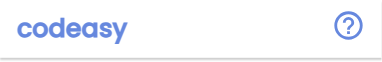

  * Featured at the top of the website, the fully responsive header includes links to the codeasy logo and Quiz Guide page.
  * This feature will allow user to easily navigate between two pages.

<b>Home section</b>

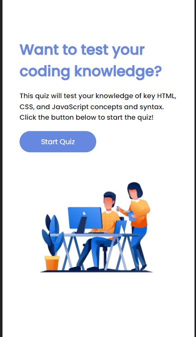

  * Home section includes two text elemnts, an image for stylistic purpose and a button that initiates the quiz.
  * This feature will allow user get some information about the website and they can achieve using it as well as initiate the quiz with "Start Quiz" button.

<b>Quiz</b>

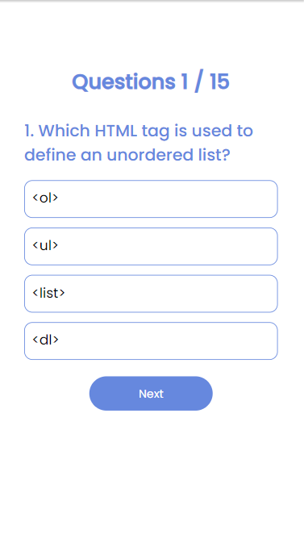

  * Quiz includes 2 text elements, an unordered list and a "Next" button that enables user that go to the next quiz question.
  * This feature will allow user to go through 15 questions on HTML, CSS and JavaScript fundamentals as well as having four different options to choose from. The "Next" is also disabled, preventing user from going to the next question if the existing one is not being selected.

<b>Selected answers</b>

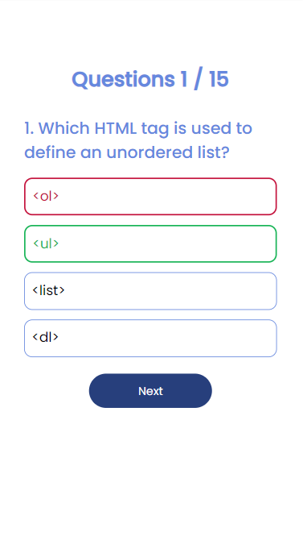

  * This feature allows user to see the correct answer if the answer they selected is incorrect as well as enable the "Next" button to work highlighting it in a darker colour.

<b>Score</b>

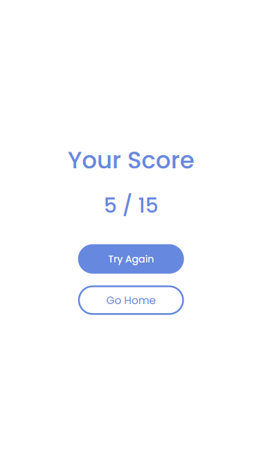

  * This feature includes a text element, span element and two buttons. 
  * It will allow user see their score as well as enable them to restart the quiz by clicking on "Try Again button" or go to Home section by ckicking on "Go Home" button.

<b>Footer</b>

  * Featured at the bottom of the website, the fully responsive footer enables the user to visit social media pages, each being open in a separate page

<b>Quiz Guide</b>

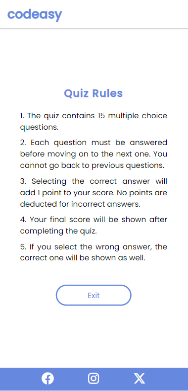

  * Quiz Guide page includes a header, footer, h2 element, an unordered list and a button.
  * This feature will allow user familiarize themselves with the quiz rules as well as enable them to leave the page by clicking on "Exit" button.

### Features Left to Implement

* Timer - A timer that counts down during the quiz engages users and tests their knowledge under time time constrains creating more compelling and realistic quiz experience. 
* Saving username and score - Allowing users to save their score and usernames personalizes the experience and enables tracking progress across sessions. Saved scores and usernames would be intergrated into a leaderboard.
* 404 page that will give clear notification for the user if any links are broken.

## Testing

### Validator Testing

#### HTML

##### index.html

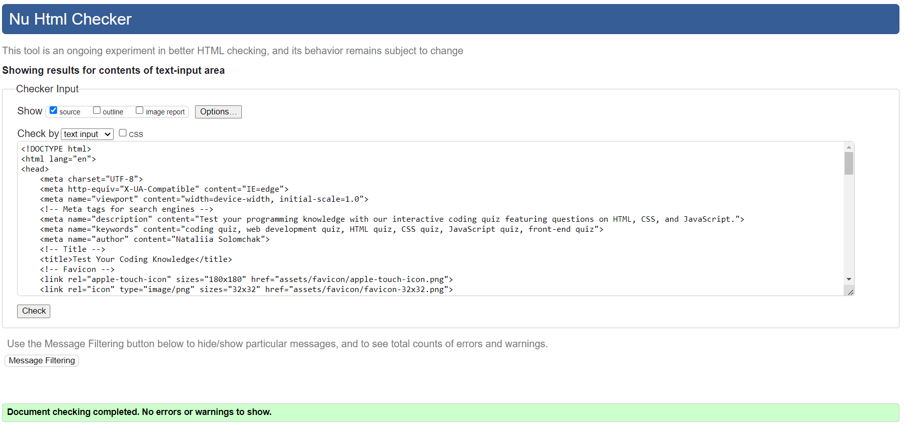

* No errors were returned when passing through the official [W3C validation](https://validator.w3.org/)

##### quizguide.html

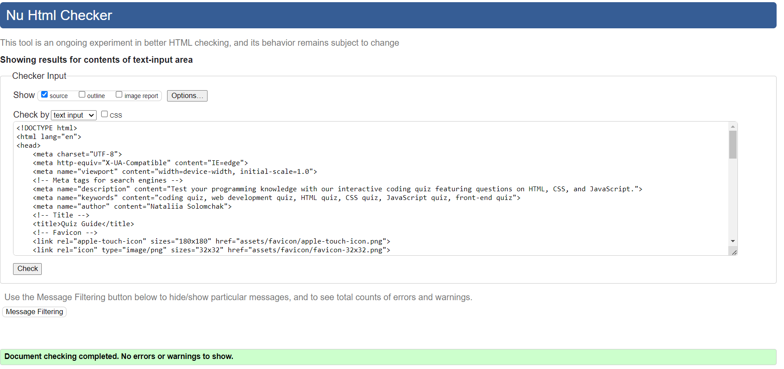

* No errors were returned when passing through the official [W3C validation](https://validator.w3.org/)

#### CSS

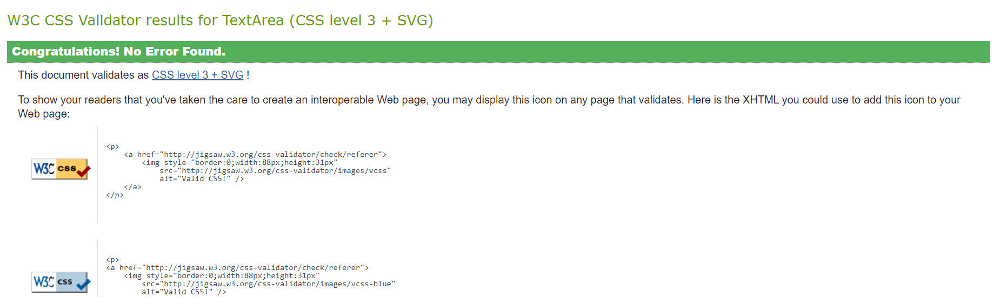

* No errors were returned when passing through the official [Jigsaw](https://jigsaw.w3.org/css-validator/)

#### JavaScript

##### questions.js

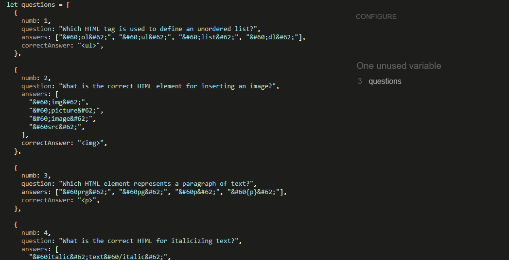

* No errors were returned when passing through the official [JSHint JavaScript Validator](https://jshint.com/)

##### script.js

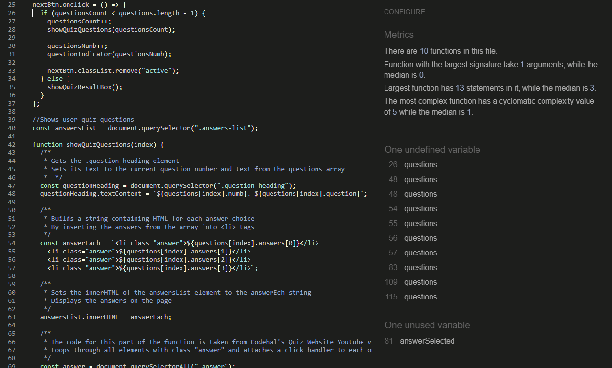

* No errors were returned when passing through the official [JSHint JavaScript Validator](https://jshint.com/). The questions variable was undefined as it was declared in another js file.

### Accessibility

To ensure that the website was accessible to all users the following steps were taken:

* An image has clear alt attribute that explains it is about.
* Aria-labels were included to all the internal and external links as well as buttons to provide the purpose for them for screen readers.

### SEO

Meta tags were included in a head of html file to tell the search engines and users more about the website and the information it contains.

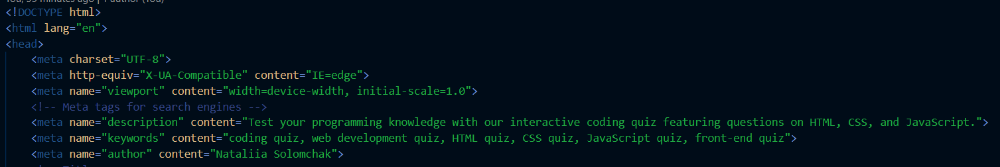

### Lighthouse

Lighthouse (Chrome's developer tool) was used to assess the performance of the website across mobiles and desktops.

#### index.html

* Mobile

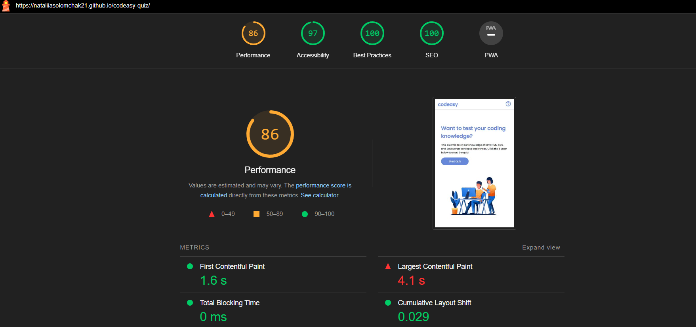

* Desktop
  
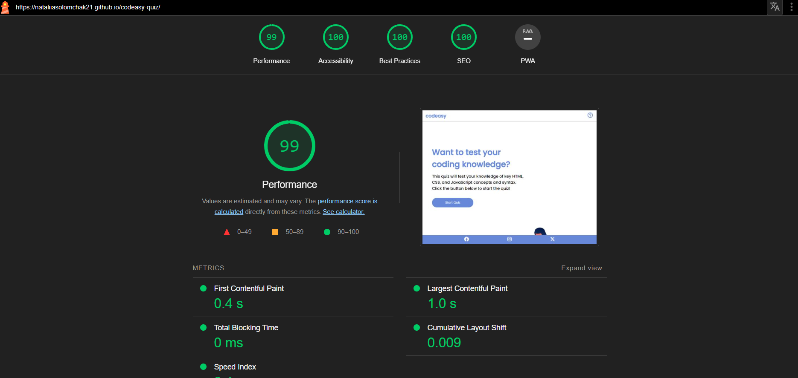
#### quizguide.html

* Mobile

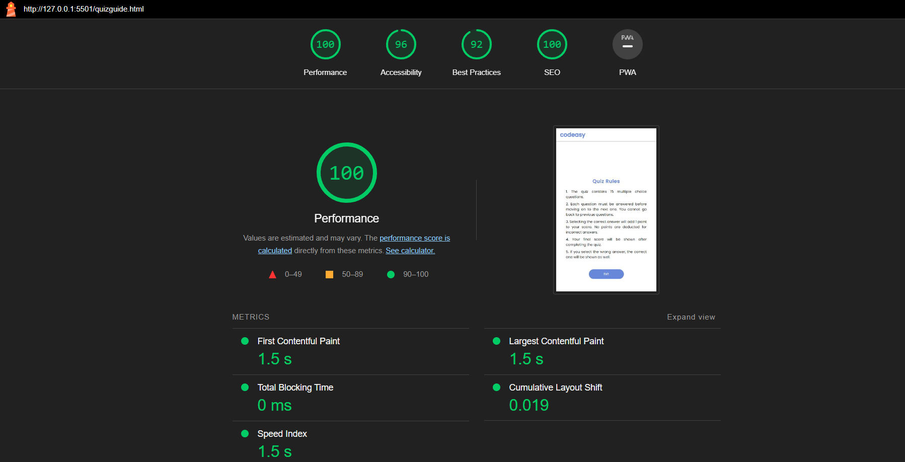

* Desktop
  
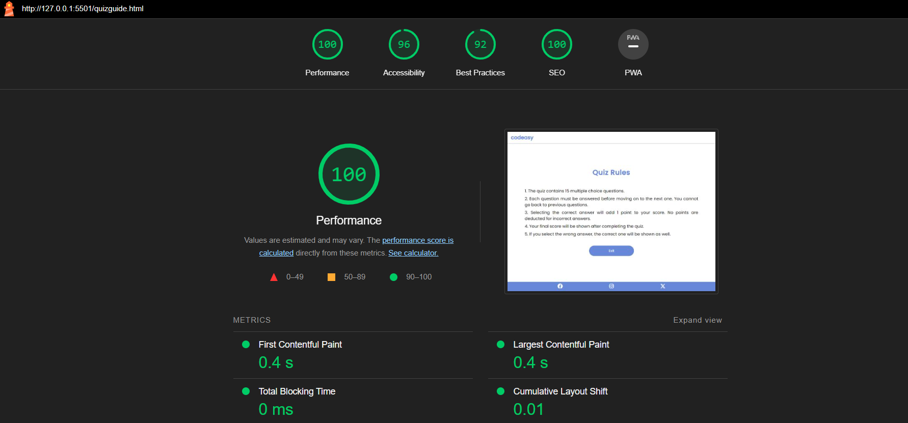

### Manual Testing

Manual testing was conducted on mobile, tablet, laptop and desktop.

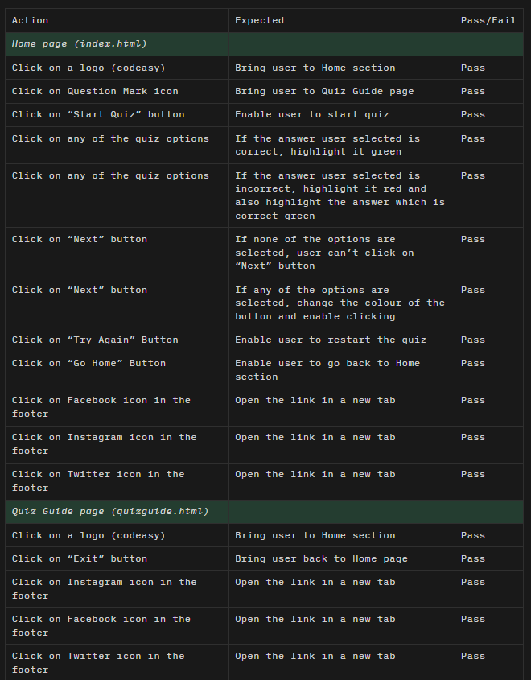

* The only issue is that on tablet the "Start Quiz" button is being difficult to click on. The reason for this is unknown.

#### Screen sizes

The website works well and is responsive on the following mobiles and tablets (these were tested manually):

<b>Samsung Galaxy A34</b>

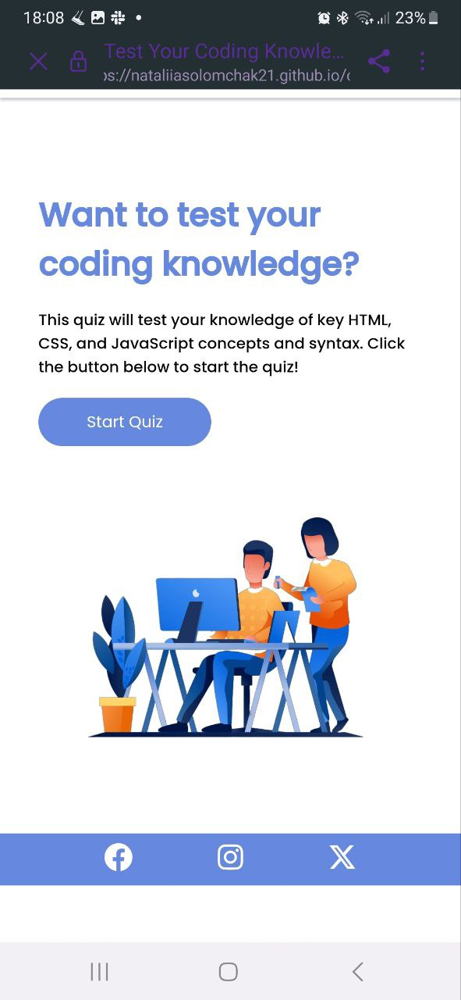

There is an issue with html pages on this device a little bit of space appearing when you go to Quiz Guide page. To get rid of that, you need to pull the screen down

<b>Oppo A12</b>

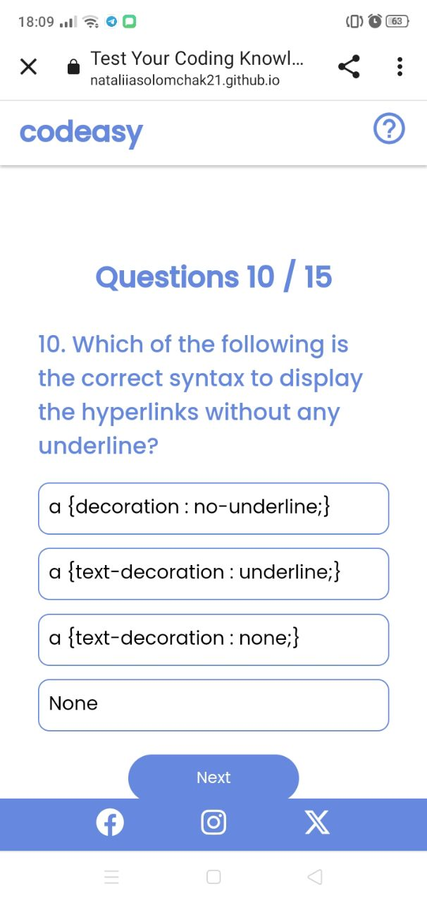

There is no issues with the screen on this device, however the quiz elements are too big for this screen which means they are not responsive enough

* Samsung Galaxy S8+
* iPad

### Browsers

The website functions in the following browsers:

* Chrome
* Opera
* Microsoft Edge
* Firefox

### Unfixed Bugs

<b>Unfixed bug with reduntant space</b>

* There is an issue with html pages on this device a little bit of space appearing when you go to Quiz Guide page. To get rid of that, you need to pull the screen down

<b>Unfixed bug with image</b>

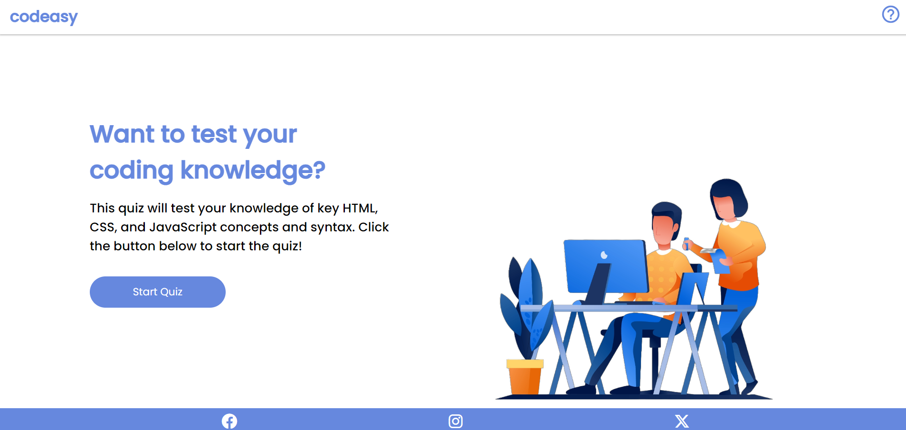

* On a laptop, the image in Home section is being positioned too low although the positioning for the div it is in is centered.

### Fixed Bugs

* I had an error appearing in a console when you go to Quiz Guide page. The error said to be with a "Start Quiz" button. I figured out that the reason it's showing an error is that there is no Javascript on this page yet there is a script element in a body of the page. So I removed the JavaScript files from quizguide.html page as there was no point of having them there.

## Technologies Used

* [Figma](https://www.figma.com/) was used to create the final design of a website.
* [Font Awesome](https://fontawesome.com/) was used for social media icons in the footer.
* [Iconify](https://iconify.design/) was used for Question Marl icon in the header.
* [Favicon](https://favicon.io/) was used for favicons.
* [Google Fonts](https://fonts.google.com/) was used to add specific font family to the stylesheet.
* [Adobe Color](https://color.adobe.com/create/color-wheel) was used to create a colour palette.
* [Balsamiq](https://balsamiq.com/wireframes/?gad=1&gclid=EAIaIQobChMI0e6F_qbkgAMVBKnVCh1HRgnBEAAYASAAEgLVSvD_BwE) was used to create wireframes to show the initial layout of the website.
* [VSCode](https://code.visualstudio.com/) was used to code the website.
* [W3C validation](https://validator.w3.org/) was used to check the markup validity of html file.
* [Jigsaw](https://jigsaw.w3.org/css-validator/) was used to check the validity of css file.
* [JSHint](https://jshint.com/) was used to check the validity of css file.
* [Am I Responsive](https://ui.dev/amiresponsive) was used to get a screenshot of a final look of the website on various devices.
* [Github](https://github.com/) was used to store the code of the website.
* Chrome DevTools was used to check the responsiveness of the website as well as to debug it.
* Chrome's Developer Tool Lighthouse was used to check the performance of the website.

## Languages Used

* HTML5 was used to create the structure of the website.
* CSS3 was used to style the website.
* JavaScript was used for interactivity.

## Deployment

### Github Pages

The project was deployed to Github Pages using the following steps:

   1. Log in to Github or sign up (if you don't have an account).
   2. Locate the repository for the project called 'codeasy-quiz'.
   3. Go to Settings page.
   4. Choose Pages in a navigational bar on the left-hand side.
   5. Under 'Build and deployment', you'll see 'Source'. Choose 'Deploy to Branch' from dropdown menu. 
   6. Make sure that 'main' branch is selected and folder is set to '/ (root)'. Click 'Save'.
   7. Refresh the page and you'll see the link to your website.
   8. Congratulations! Your website has been deployed.

### How to Fork the Github Repository

1. If you want to fork the repository log in to Github or create an account.
2. Locate to the repository for the project called 'codeasy-quiz'.
3. In the top right corner click on 'Fork' button. 
4. Now you have a copy of the original repository in your Github account.

### How to Clone the Github Repository

1. If you want to clone the repository log in to Github or create an account.
2. Go to the main page of the repository 'codeasy-quiz'.
3. Click on '<> Code' and copy the URL from HTTPS.
4. Open Git Bash.
5. Change your current working directory to the location where you want your clone to be made.
6. Type 'git clone' into your terminal window, paste the URL you copied earlier and press Enter to create your local clone.

## Credits

### Content

* The text content for the Home section and Quiz Guide page was created by me.
* The HTML questions were created by me.
* CSS questions were taken from [here](https://www.dailyrecruitment.in/css-multiple-choice-questions-and-answer-quiz/).
* JavaScript questions were taken from [here](https://basescripts.com/110-javascript-quiz-questions-with-solutions-pdf-download-test-your-knowledge).
### Media

* The hero image was taken from [here](https://br.pinterest.com/pin/606649012296185462/).
* The favicon image was taken from [here](https://pixabay.com/vectors/symbol-gui-internet-internet-page-2485367/).

### Code

* The code for social media icons was also taken from [Love Running Project](https://learn.codeinstitute.net/courses/course-v1:CodeInstitute+LRFX101+2023_Q2/courseware/e805068059af42af87681032aa64053f/7525117e5cd144daa2a7b0c57843bbee/?child=first) by [Code Institute](https://codeinstitute.net/ie/full-stack-software-development-diploma/?utm_term=code%20institute&utm_campaign=CI+-+IRL+-+Search+-+Brand&utm_source=adwords&utm_medium=ppc&hsa_acc=8983321581&hsa_cam=14304747355&hsa_grp=128775288209&hsa_ad=635725005315&hsa_src=g&hsa_tgt=kwd-319867646331&hsa_kw=code%20institute&hsa_mt=e&hsa_net=adwords&hsa_ver=3&gad=1&gclid=EAIaIQobChMI-6Pgu9jmgAMVzjcGAB3SFA1FEAAYASAAEgKGQvD_BwE) and was used only in html file. The comment about it is in html file.
* All the JavaScript code was made by me besides the one mentioned in comments in script.js file. Also the functionality of showQuizQuestions function was inspired by [Codehal's "How To Make Quiz Website Using HTML CSS And Javascript" Youtube video](https://www.youtube.com/watch?v=Vp8x8-reqZA&t=3713s). The overall quiz may seem similar to what is in the video as I was struggling with it a lot but while using some of the functuonality from this video I still created my own code as well because I didn't want to blatantly copy and paste someone else's work.
* All the HTML and CSS was written by me.

## Acknowledgements

I would like to thank my mentor Dick Vlaanderen for his valuable advices throughout the whole project and our facilitator Marko Tot for sharing his experience and teaching me tips and tricks on how to make my project better.