# Codeasy Quiz

View the live project [here](https://nataliiasolomchak21.github.io/codeasy-quiz/)

Codeasy Quiz is a 2-page educational website that allows users to assess their coding knowledge. This interactive quiz contains 15 questions evaluating users' level of knowing HTML, CSS and JavaScript fundamentals. 

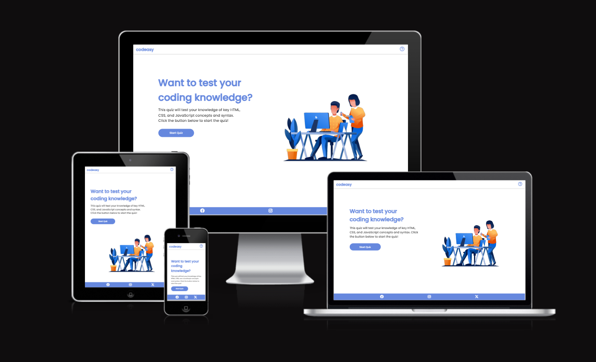

## User Experience

### Target Audience

* Beginner coders - Those learning HTML, CSS and JavaScript for the first time would benefit from testing their knowledge od each language's fundamentals. The quiz would allow them to identify gaps and topics they need to focus more on.
* Students in web development courses - The quiz could be useful for those enrolled in classes on web programming topics as a supplemental assessment.
* Self-learners - People teaching themselves coding through online resources couls use the quiz to formally benchmark their progress.
* Bootcamp attendees - Coding bootcamp students could take the quiz to see how well they absorb introductory web development languages taught in bootcamp curriculums.
* Hobbyists - Those learning development skills for personal interests/hobbies may find assessment and feedback valuable.

### Key Project Goals

* Provide questions testing core knowledge of HTML, CSS and JavaScript - Ensure a balanced set of questions covering fundamentals of each language.
* Implement dynamic quiz functuonality - Allow users to take the quiz, track answers and provide feedback.
* Build an intuative UI/UX - A clean, easy-to-use interface maximizing usability and user experience.
* Make it accessible and responsive - Ensure the website and quiz are accessible to users with disabilities and work across devices.

### User Stories

#### First Time Visitor Goals

* I want to navigate through the website easily using navigation option in header.
* I want to get a clear feedback to any of my actions.
* I want to navigate through the quiz itself easily using buttons.
* I want to see my score after completing the quiz.
* I want to be familiar with the quiz rules.

#### Frequent Visitor Goals

* I want to be able to use the website across all the devices.

## Design Stage

### Wireframes

#### Header

<b>Mobile</b>

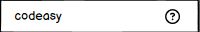

<b>Desktop</b>

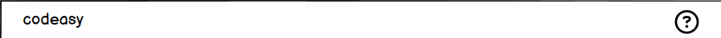

The header looks the same on all the devices. It includes a logo and a link to Quiz Guide page.

<b>Home page</b>

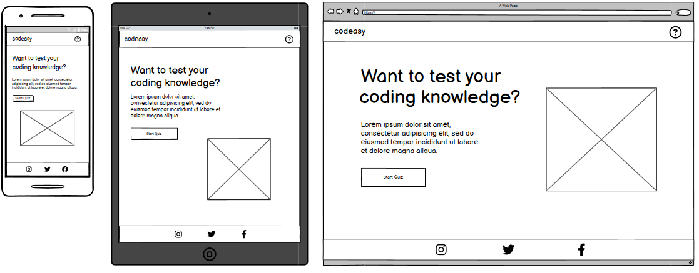

 

Home section includes h2 element, a small paragraph, button and an image. The home section is responsive and looks similar on all the devices with minor adjustments added such as positioning in a row for desktops and increased font size.

<b>Quiz Guide page</b>

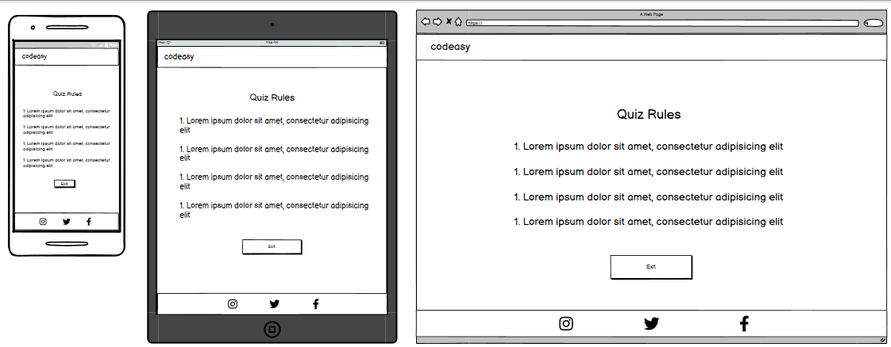

 

Quiz Guide includes an h2 element, an unordered list and a link that brings user back to Home page. 

<b>Quiz Game</b>

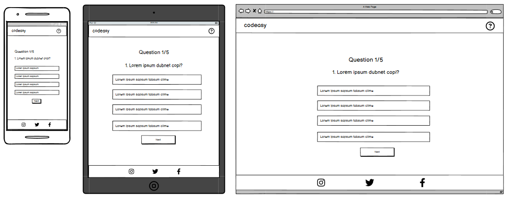

 
Quiz includes a heading, question counter, 4 options for user to choose from and a "Next" button. The quiz is responsive across all devices with minor adjustments like positioning and increased font size.

<b>Score</b>

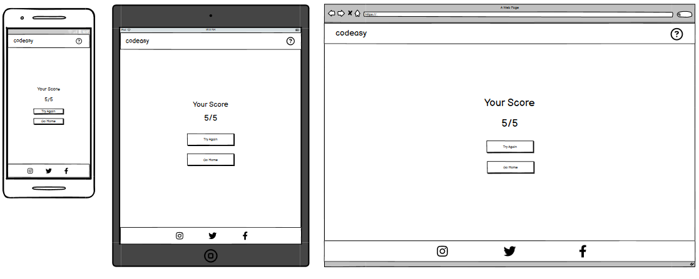

 
Score includes an h2 element, a span element, button to restart the quiz and a link to the Home page. The score part of the website is responsive across all the devices with minor adjustments like font size.

#### Footer

<b>Mobile</b>

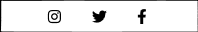

<b>Destop</b>

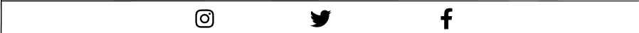

 
The footer includes links to Instagram, Facebook and Twitter each opening in a new tab for accessibility.

### Colour Palette

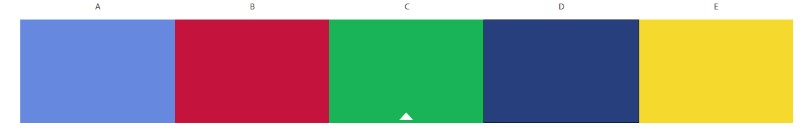

For this project, I chose the bright colors to be presented in my colour palette as they have a positive affect on the user experince. I also used black and white colours as well as rgba(0, 0, 0, .2) for drop shadow on header.

### Final Design

#### Mobile

<b>(360x740)</b>

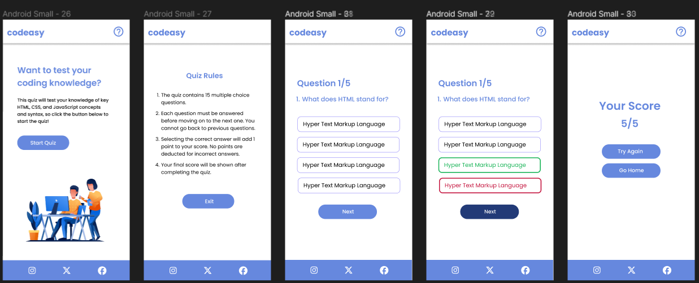

 

#### Tablet

<b>(768x1024)</b>

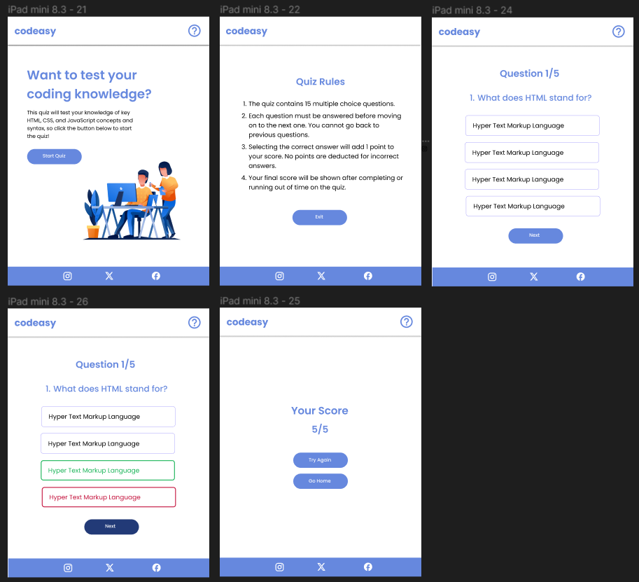

 

#### Desktop

<b>(1440x1024)</b>

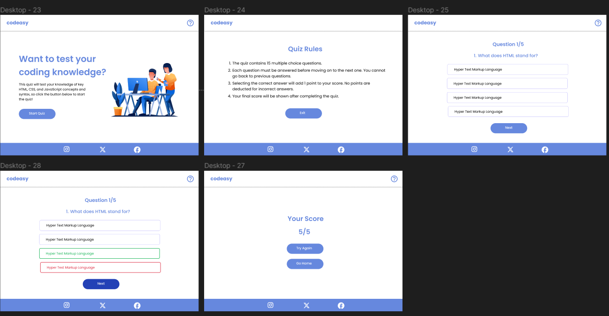

 

For the font, I used Poppins font family as it fit best into the design and was readable for the user.

## Features

## Testing

## Technologies Used

## Languages Used

## Deployment

## Credits

## Acknowledgements